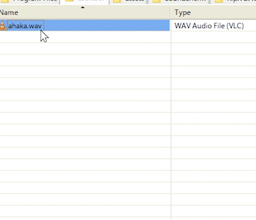

# SoundSheriff

SoundSheriff lets you convert, normalize, extract, resample, and mono-mix media files straight from Windows Explorer using simple right-click actions.



## Features

- Convert audio to WAV, FLAC, AIFF, Opus, Vorbis, MP3, or AAC.
- Extract audio from video files.
- Convert stereo audio to mono.
- Resample audio to common sample rates.
- Normalize audio for streaming services.
- Preserve metadata where the operation supports it.

## Supported File Types

Audio context menu entries are registered for:

```text
.wav .aiff .flac .mp3 .wma .opus .ogg .aac .m4a
```

Video audio-extraction entries are registered for:

```text
.mp4 .avi .mov .webm
```

## Install

Download the latest `SoundSheriffSetup.exe` from the project releases and run it.
The installer requires administrator privileges because it writes Explorer
context menu entries under `HKEY_LOCAL_MACHINE`.

The installer installs to:

```text
C:\Program Files\SoundSheriff
```

That path is intentional. `context_menu.reg` currently contains absolute command
paths for `C:\Program Files\SoundSheriff`, so the installer is locked to that
directory and targets 64-bit Windows.

After installation, right-click a supported media file and choose
`SoundSheriff`.

## How it works

SoundSheriff adds custom Explorer context menu entries through the Windows registry. Each menu action runs a PowerShell script invoking FFmpeg commandline binaries for the actual processing.

## Development Setup

Clone the repository on 64-bit Windows.

```bat
git clone <repo-url>
cd SoundSheriff
```

Download the local FFmpeg tools used by the scripts and installer:

```bat
download-ffmpeg.bat
```

This populates:

```text
bin\ffmpeg.exe
bin\ffprobe.exe
licenses\FFmpeg-LICENSE.txt
licenses\FFmpeg-README.txt
```

The FFmpeg executables are intentionally not committed to Git. They are large
third-party binaries and are ignored by `.gitignore`.

## Running From Source

The scripts resolve FFmpeg through `SoundSheriff.Tools.ps1`. They first look for
bundled tools in `bin\`, then fall back to `PATH`.

You can run a script directly, for example:

```powershell
powershell.exe -ExecutionPolicy Bypass -File .\Convert.ps1 "C:\path\song.wav" flac
powershell.exe -ExecutionPolicy Bypass -File .\Normalize.ps1 "C:\path\song.wav"
```

For context menu testing during development, either install the built installer
in a disposable Windows environment or import `context_menu.reg` manually as
administrator after making sure `C:\Program Files\SoundSheriff` points at the
files you want to run.

If `C:\Program Files\SoundSheriff` is a symlink to your development checkout,
running the installer will write through that symlink and may overwrite local
files. Treat that setup as a development convenience, not as an installer test.

## Building The Installer

Prerequisites:

- 64-bit Windows.
- Inno Setup 6.
- FFmpeg tools downloaded with `download-ffmpeg.bat`.

Build:

```bat
build-installer.bat
```

The output is:

```text
dist\SoundSheriffSetup.exe
```

If the build fails because the output file is in use, close any running
SoundSheriff installer window and run the build again.

## Project Layout

```text
assets\SoundSheriff.iss      Inno Setup installer script
assets\sheriff.ico           Context menu / uninstall icon
bin\.gitkeep                 Placeholder for local FFmpeg binaries
bpm\                         Experimental BPM detection source
context_menu.reg             Windows Explorer context menu registration
SoundSheriff.Tools.ps1       FFmpeg/FFprobe resolver
Convert.ps1                  Audio conversion commands
ExtractAudio.ps1             Video audio extraction commands
Mono.ps1                     Stereo-to-mono command
Normalize.ps1                Two-pass loudness normalization
Resample.ps1                 Sample-rate conversion
download-ffmpeg.*            Fetch pinned FFmpeg binaries for local builds
build-installer.bat          Build the Inno Setup installer
licenses\                    Third-party FFmpeg license/source notes
```

## FFmpeg And Licensing

SoundSheriff invokes FFmpeg as separate command-line programs. Release builds
bundle Gyan's FFmpeg `8.1.1-essentials_build-www.gyan.dev`, which is licensed
under GPL v3. The exact source commit, archive checksum, and bundled license
files are recorded in:

```text
THIRD_PARTY_NOTICES.md
licenses\FFmpeg-SOURCE.txt
```

Before publishing releases, make sure the repository license is compatible with
the bundled FFmpeg build.
